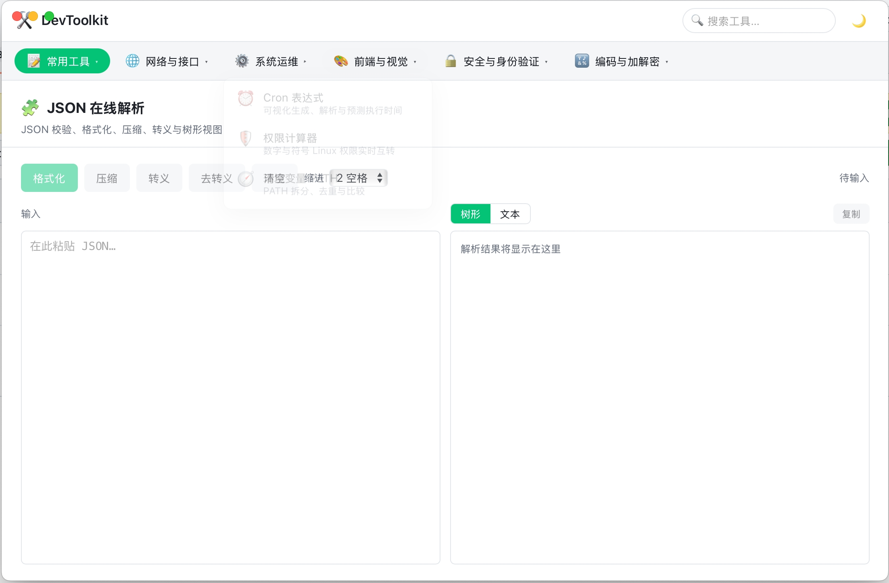

# DevToolkit

[](LICENSE)

**轻量、离线、隐私优先的一体化开发者工具箱**

DevToolkit 是一款桌面应用，将日常开发中高频使用的工具集成到一处，涵盖文本处理、网络调试、系统运维、前端开发、安全验证等多个领域。所有工具默认在本地运行，无需联网即可使用，让你的数据始终留在自己手中。



## 功能特性

### 一、常用工具

- **JSON 在线解析** - JSON 校验、格式化、压缩、转义与树形视图
- **文本比对** - 文本 / 代码 / JSON 双栏比对，支持行级与字符级差异高亮
- **正则测试** - 正则表达式测试器，内置常用正则库（邮箱、手机号、身份证号、IPv4/IPv6）
- **Mock 数据** - 批量生成随机模拟数据（姓名、地址、手机号、邮箱、银行卡号、Lorem Ipsum）
- **时间戳转换** - Unix 时间戳与普通时间互转，实时显示当前时间戳

### 二、网络与接口

- **URL 解析** - URL 拆解解析，查询参数可视化编辑与重组
- **cURL 转换** - 将 cURL 命令转换为 Python / JavaScript / Go / Java 请求代码
- **DNS 解析** - 查询域名的 A / AAAA / CNAME / MX / NS / TXT 记录

### 三、系统运维

- **Cron 表达式** - Cron 表达式解析与生成，可视化配置并预测执行时间
- **权限计算器** - Linux 权限计算器，数字权限与符号权限实时互转
- **环境变量 PATH** - PATH 拆分、去重与比较

### 四、前端与视觉

- **颜色转换** - 颜色值转换（HEX / RGB / RGBA / HSL）
- **屏幕取色器** - 鼠标指向屏幕任意位置实时取色，输出 HEX / RGB / RGBA / HSL
- **二维码** - 二维码生成与图片解码
- **SVG 优化** - SVG 清理压缩与实时预览
- **图片尺寸调整** - 调整图片尺寸，支持预设规格与自定义宽高

### 五、安全与身份验证

- **JWT 解码** - JWT 解码与格式化，自动识别过期状态
- **强密码生成** - 强密码生成器，支持批量生成与 Bcrypt 哈希
- **文件密码破解** - ZIP / PDF / Word / Excel / PPT 加密文件口令找回，支持暴力枚举与字典匹配，实时显示进度（仅限本人拥有或已授权的文件，全程本地运算）

### 六、编码与加解密

- **编码转码** - Base64 / URL / Hex 编码互转
- **Unicode 编码** - ASCII / 中文 与 Unicode (\uXXXX) 互转
- **哈希与加解密** - MD5 / SHA 哈希计算，AES 对称加解密

## 技术栈

- **后端**: Go + Wails v3
- **前端**: TypeScript + Svelte + Vite
- **桌面框架**: Wails v3（跨平台）

## 快速开始

### 环境要求

- Go 1.21+
- Node.js 18+
- Wails v3 CLI

### 安装 Wails CLI

```bash
go install github.com/wailsapp/wails/v3/cmd/wails3@latest
```

### 运行开发模式

```bash
# 安装前端依赖
cd frontend && npm install && cd ..

# 启动开发服务器
task dev
```

应用将自动启动并支持热重载。

### 构建生产版本

```bash
# 构建当前平台
task build

# 打包应用
task package
```

构建产物位于 `bin/` 目录。

## 项目结构

```
DevToolkit/
├── main.go                 # 应用入口
├── services_*.go           # 后端服务层
├── internal/pkg/           # 核心功能包
│   ├── chmod/              # Linux 权限计算
│   ├── codecx/             # 编码转换
│   ├── colorx/             # 颜色转换
│   ├── crackx/             # 加密文件口令找回（ZIP/PDF/Office）
│   ├── cronx/              # Cron 解析
│   ├── cryptox/            # 哈希与加解密
│   ├── curlconv/           # cURL 转换
│   ├── differ/             # 文本比对
│   ├── dnsx/               # DNS 解析
│   ├── jwtx/               # JWT 解码
│   ├── mockgen/            # Mock 数据生成
│   ├── pathx/              # PATH 变量处理
│   ├── pwdgen/             # 密码生成
│   ├── qrx/                # 二维码
│   ├── regexx/             # 正则测试
│   ├── screenpick/         # 屏幕取色
│   ├── svgopt/             # SVG 优化
│   └── urlparse/           # URL 解析
├── frontend/               # 前端代码
│   ├── src/                # Svelte 组件
│   ├── bindings/           # TypeScript 类型绑定
│   └── dist/               # 构建输出
├── build/                  # 平台构建配置
└── Taskfile.yml            # 任务定义
```

## 常用命令

| 命令 | 说明 |
|------|------|
| `task dev` | 启动开发服务器（热重载） |
| `task build` | 构建应用 |
| `task package` | 打包应用 |
| `task run` | 运行已构建的应用 |
| `task build:server` | 构建服务器模式（无 GUI） |
| `task run:server` | 运行服务器模式 |

## 跨平台构建
   
支持以下平台：

- **macOS**: `task darwin:build`
- **Windows**: `task windows:build`
- **Linux**: `task linux:build`
- **iOS**: `task ios:build` (实验性)
- **Android**: `task android:build` (实验性)

## 数据隐私

DevToolkit 的设计原则：

- ✅ 所有工具默认本地执行，不向外部传输任何用户数据
- ✅ 大部分功能无需联网即可使用
- ⚠️ 少数功能（HTTP 请求、IP 地理位置查询、DNS 解析）需要网络连接

## 开发指南

### 添加新工具模块

1. 在 `internal/pkg/` 创建功能包
2. 在根目录创建对应的 `services_*.go` 服务层
3. 在 `main.go` 注册服务
4. 运行 `task dev` 自动生成前端绑定

### 前端开发

前端使用 Svelte + TypeScript，位于 `frontend/` 目录：

```bash
cd frontend
npm install       # 安装依赖
npm run dev       # 启动 Vite 开发服务器
npm run build     # 构建生产版本
```

## 许可证

本项目基于 [MIT License](LICENSE) 开源。

## 致谢

- [Wails](https://wails.io/) - Go 桌面应用框架
- [Svelte](https://svelte.dev/) - 前端框架
- [Task](https://taskfile.dev/) - 任务运行器
